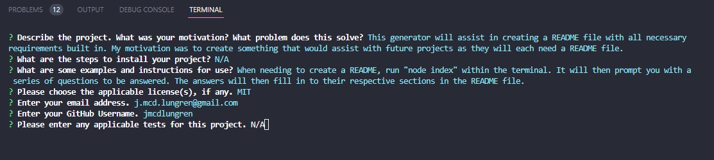

# README Generator

## Description

This generator will assist in creating a README file with all necessary requirements built in. My motivation was to create something that would assist with future projects as they will each need a README file.

## Table of Contents

- [Installation](#installation)
- [Usage](#usage)
- [License](#license)
- [Questions and Contributing](#questions-and-contributing)
- [Tests](#tests)

## Installation

N/A

## Usage

When needing to create a README, run "node index" within the terminal. It will then prompt you with a series of questions to be answered. The answers will then fill in to their respective sections in the README file.

Screenshot:

## License

[The MIT License](https://opensource.org/licenses/MIT)

## Questions and Contributing

If you have any questions, you can contact me by [email](j.mcd.lungren@gmail.com) or through [GitHub](https://github.com/jmcdlungren).

If you are interested in contributing, please follow the guidelines outlined within the [Contributor Covenant](https://www.contributor-covenant.org/).

## Tests

[Example Test Video](https://drive.google.com/file/d/1ZTmud7zMMANWmc0MpaB_OC7lL9taU_H1/view)

GIF of Example Test:

